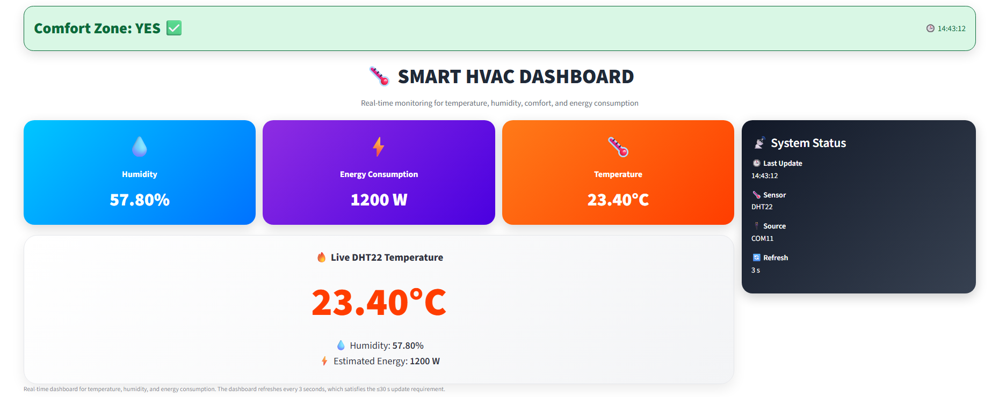

# Smart HVAC System for Thermal Comfort & Energy Optimization

An AI-powered HVAC system designed to improve thermal comfort and reduce energy consumption in offshore rig cabins.

This project combines **Computer Vision**, **Real-Time Monitoring**, and **Statistical Process Control (SPC)** to intelligently manage cabin environmental conditions.

---

## Features

- 👤 Real-time occupant detection using **YOLOv8**.
- 📍 Intelligent 2×2 cabin zoning for occupancy-aware airflow control.
- 🌡️ Live monitoring of temperature and humidity.
- ⚡ Real-time HVAC dashboard built with **Python Streamlit**.
- 📊 Statistical Process Control (I-MR Charts) for environmental monitoring.
- 💾 Automatic export of stable occupancy metadata for Industrial Systems Engineering (ISE) integration.
- 🎥 Optional video recording and CSV logging.

---

## Technologies

- Python
- YOLOv8 (Ultralytics)
- OpenCV
- Streamlit
- Pandas
- NumPy
- Matplotlib

---

## Project Structure

```text
Smart-HVAC-System/
│
├── dashboard.py                 # Streamlit monitoring dashboard
├── realtime_yolo_stable_cs.py   # Real-time occupant detection
├── serial_reader.py             # Reads sensor data
├── spc_monitor.py               # SPC calculations
├── spc_panel.py                 # SPC visualization
├── sensor_data.json             # Live sensor values
├── requirements.txt
├── .gitignore
│
├── ise_exports/                 # Generated metadata
└── runs/                        # Detection outputs
```

---

## How it Works

1. Detect occupants using YOLOv8.
2. Divide the cabin into four zones.
3. Determine the dominant occupied zone.
4. Apply temporal stability logic before accepting occupancy changes.
5. Export stable metadata for downstream systems.
6. Display live environmental data and SPC charts through the dashboard.

---

## Run the Project

Install dependencies:

```bash
pip install -r requirements.txt
```

Run the Computer Vision module:

```bash
python realtime_yolo_stable_cs.py
```

Run the dashboard:

```bash
python -m streamlit run dashboard.py
```

---

## Dashboard

The dashboard displays:

- Live temperature
- Humidity
- Estimated energy consumption
- Comfort zone status
- I-MR Statistical Process Control charts
- System health information

---

## Computer Vision Module

The perception module provides:

- Real-time person detection
- Occupancy counting
- Four-zone localization
- Stable occupancy estimation
- Metadata export
- CSV and video logging

---

## Results

The complete HVAC system achieved:

- ✅ 21% reduction in energy consumption
- ✅ 85% occupancy detection accuracy
- ✅ Temperature stability within ±0.93°C
- ✅ Steady-state thermal conditions in approximately 6 minutes

---

## Author

**Abdulrahman Alhaidari**

GitHub: https://github.com/7aidary
